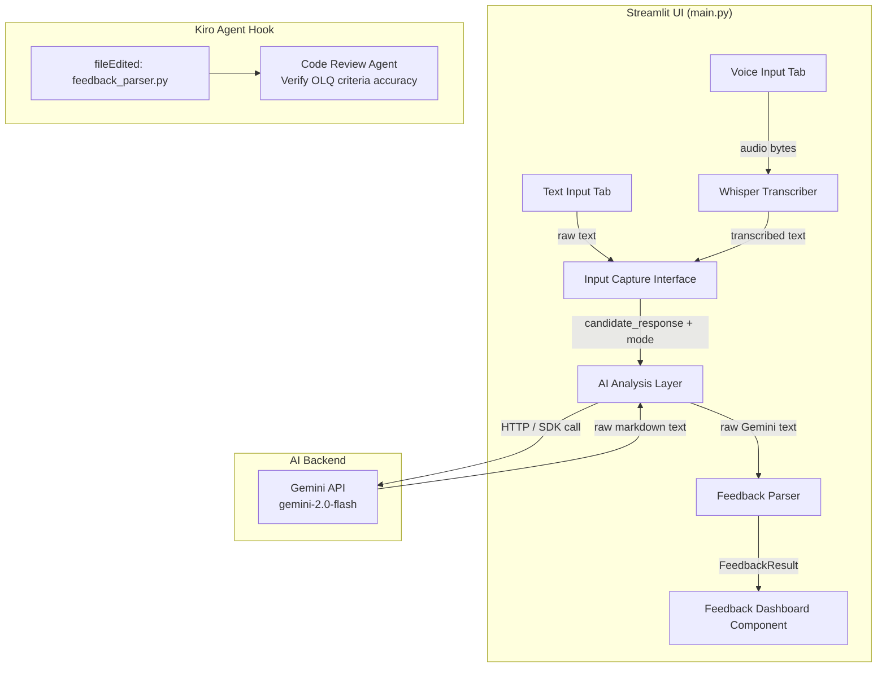
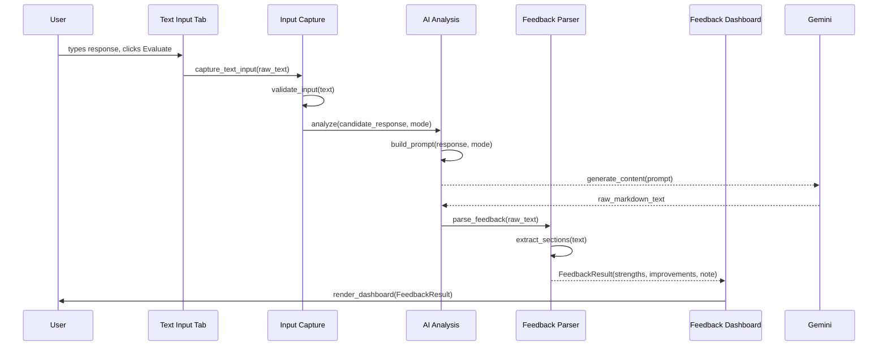
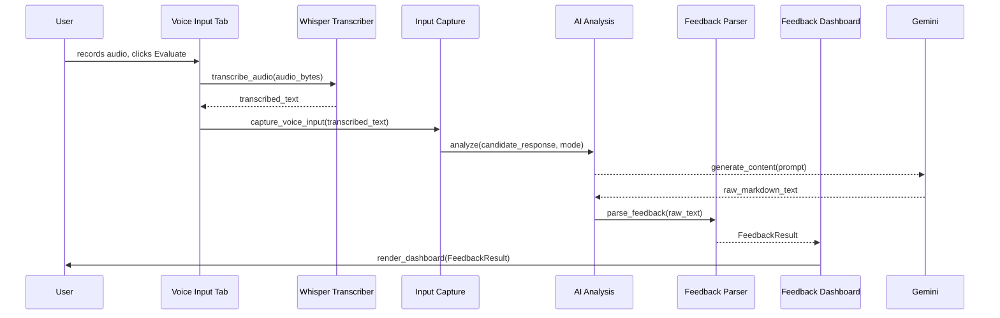

# Design Document: SSB Feedback Integration

## Overview

This feature formalises the end-to-end pipeline that connects the user's practice input (typed text or Whisper-transcribed audio) to a Gemini-powered OLQ analysis backend, and surfaces the structured feedback in a dedicated **Feedback Dashboard** component inside the Streamlit app.

The existing `main.py` already contains a working `get_feedback()` helper and two input tabs. This design refactors and extends that code into clearly separated concerns: an **Input Capture** layer, an **AI Analysis** layer, a **Feedback Parser**, and a **Feedback Dashboard** UI component — while preserving full backward compatibility with the current single-file structure.

The design also specifies a Kiro agent hook that automatically triggers a code-review prompt whenever the feedback-parsing logic is modified, ensuring SSB evaluation criteria remain accurate over time.

---

## Architecture



---

## Sequence Diagrams

### Text Input → Feedback Flow



### Voice Input → Feedback Flow



---

## Components and Interfaces

### Component 1: Input Capture Interface

**Purpose**: Validates and normalises user input from both text and voice tabs before passing it downstream.

**Interface**:
```python
def capture_text_input(raw_text: str) -> str:
    """Strips whitespace, raises ValueError if empty."""

def capture_voice_input(transcribed_text: str) -> str:
    """Accepts Whisper output; raises ValueError if empty or transcription failed."""

def validate_input(text: str) -> bool:
    """Returns True if text is non-empty after stripping."""
```

**Responsibilities**:
- Normalise whitespace
- Raise descriptive errors for empty or invalid input
- Provide a single entry point so both tabs share identical validation logic

---

### Component 2: AI Analysis Layer

**Purpose**: Constructs the OLQ evaluation prompt and calls the Gemini API.

**Interface**:
```python
def build_prompt(candidate_response: str, mode: str) -> str:
    """Injects response and mode into SYSTEM_PROMPT template."""

def analyze(candidate_response: str, mode: str, client: genai.Client) -> str:
    """Calls Gemini and returns raw response text. Raises RuntimeError on API failure."""
```

**Responsibilities**:
- Own the `SYSTEM_PROMPT` template
- Handle Gemini SDK errors and surface them as `RuntimeError`
- Return raw text for the parser to process (no parsing here)

---

### Component 3: Feedback Parser

**Purpose**: Converts the raw Gemini markdown response into a structured `FeedbackResult` dataclass.

**Interface**:
```python
@dataclass
class FeedbackResult:
    strengths: str       # content under ✅ STRENGTHS
    improvements: str    # content under 🔧 IMPROVEMENTS
    motivational_note: str  # content under 💡 MOTIVATIONAL NOTE
    raw: str             # original unparsed text (fallback)

def parse_feedback(raw_text: str) -> FeedbackResult:
    """
    Parses the three sections from the Gemini response.
    Falls back to raw text in all fields if parsing fails.
    """

def extract_section(raw_text: str, header: str, next_header: str | None) -> str:
    """
    Extracts text between `header` and `next_header` (or end of string).
    Returns empty string if header not found.
    """
```

**Responsibilities**:
- Parse the three fixed sections (STRENGTHS, IMPROVEMENTS, MOTIVATIONAL NOTE)
- Provide a graceful fallback so the UI never crashes on unexpected Gemini output
- Keep parsing logic isolated so the agent hook can target this file specifically

---

### Component 4: Feedback Dashboard

**Purpose**: Renders the `FeedbackResult` in a visually structured Streamlit UI.

**Interface**:
```python
def render_feedback_dashboard(result: FeedbackResult) -> None:
    """
    Renders three expandable sections in Streamlit:
    - ✅ Strengths
    - 🔧 Improvements
    - 💡 Motivational Note
    Falls back to st.markdown(result.raw) if sections are empty.
    """
```

**Responsibilities**:
- Display each section in a labelled `st.expander` or `st.container`
- Show a fallback raw markdown block if parsing produced empty sections
- Accept only `FeedbackResult` — no direct Gemini calls

---

## Data Models

### FeedbackResult

```python
from dataclasses import dataclass

@dataclass
class FeedbackResult:
    strengths: str
    improvements: str
    motivational_note: str
    raw: str  # original Gemini output, always preserved
```

**Validation Rules**:
- `raw` must always be non-empty (set before parsing)
- `strengths`, `improvements`, `motivational_note` may be empty strings (fallback to `raw`)
- No field may be `None`

### PracticeMode (Enum)

```python
from enum import Enum

class PracticeMode(str, Enum):
    PERSONAL_INTERVIEW = "Personal Interview"
    LECTURETTE = "Lecturette"
    GROUP_DISCUSSION = "Group Discussion Entry"
    SRT = "Situation Reaction Test (SRT)"
```

---

## Algorithmic Pseudocode

### Main Processing Algorithm: `analyze()`

```pascal
PROCEDURE analyze(candidate_response, mode, client)
  INPUT:  candidate_response: String (non-empty, validated)
          mode: PracticeMode
          client: genai.Client (authenticated)
  OUTPUT: raw_text: String

  PRECONDITIONS:
    - candidate_response IS NOT empty
    - client IS authenticated (API key present)

  POSTCONDITIONS:
    - raw_text IS non-empty String
    - raw_text contains at least one of the three section headers

  BEGIN
    prompt ← build_prompt(candidate_response, mode)

    TRY
      result ← client.models.generate_content(
                  model = GEMINI_MODEL,
                  contents = prompt
               )
      ASSERT result.text IS NOT NULL
      RETURN result.text
    CATCH ApiException AS e
      RAISE RuntimeError("Gemini API error: " + e.message)
    END TRY
  END
END PROCEDURE
```

---

### Feedback Parsing Algorithm: `parse_feedback()`

```pascal
PROCEDURE parse_feedback(raw_text)
  INPUT:  raw_text: String
  OUTPUT: FeedbackResult

  PRECONDITIONS:
    - raw_text IS NOT empty

  POSTCONDITIONS:
    - result.raw = raw_text (always preserved)
    - IF all three headers found THEN
        result.strengths, result.improvements, result.motivational_note
        are non-empty substrings of raw_text
    - ELSE
        result.strengths = result.improvements = result.motivational_note = ""
        (caller falls back to result.raw)

  LOOP INVARIANT (for section extraction loop):
    - Each extracted section is a contiguous substring of raw_text
    - No two sections overlap

  BEGIN
    HEADERS ← ["✅ STRENGTHS", "🔧 IMPROVEMENTS", "💡 MOTIVATIONAL NOTE"]

    strengths        ← extract_section(raw_text, HEADERS[0], HEADERS[1])
    improvements     ← extract_section(raw_text, HEADERS[1], HEADERS[2])
    motivational_note ← extract_section(raw_text, HEADERS[2], NULL)

    RETURN FeedbackResult(
      strengths        = strengths,
      improvements     = improvements,
      motivational_note = motivational_note,
      raw              = raw_text
    )
  END
END PROCEDURE
```

---

### Section Extraction Algorithm: `extract_section()`

```pascal
PROCEDURE extract_section(raw_text, header, next_header)
  INPUT:  raw_text: String
          header: String
          next_header: String OR NULL
  OUTPUT: section_content: String

  PRECONDITIONS:
    - raw_text IS NOT empty
    - header IS NOT empty

  POSTCONDITIONS:
    - IF header NOT IN raw_text THEN RETURN ""
    - ELSE RETURN substring of raw_text between header and next_header
      (or end of string if next_header IS NULL)
    - Returned string is stripped of leading/trailing whitespace

  BEGIN
    start_idx ← raw_text.find(header)

    IF start_idx = -1 THEN
      RETURN ""
    END IF

    content_start ← start_idx + LENGTH(header)

    IF next_header IS NOT NULL THEN
      end_idx ← raw_text.find(next_header, content_start)
      IF end_idx = -1 THEN
        section_content ← raw_text[content_start : END]
      ELSE
        section_content ← raw_text[content_start : end_idx]
      END IF
    ELSE
      section_content ← raw_text[content_start : END]
    END IF

    RETURN STRIP(section_content)
  END
END PROCEDURE
```

---

### Input Validation Algorithm: `validate_input()`

```pascal
PROCEDURE validate_input(text)
  INPUT:  text: String (may be empty or whitespace-only)
  OUTPUT: is_valid: Boolean

  PRECONDITIONS:
    - text parameter is defined (may be empty string)

  POSTCONDITIONS:
    - RETURN true  IF AND ONLY IF STRIP(text) IS NOT empty
    - RETURN false IF STRIP(text) IS empty
    - No mutations to text

  BEGIN
    IF text IS NULL OR STRIP(text) = "" THEN
      RETURN false
    END IF
    RETURN true
  END
END PROCEDURE
```

---

## Key Functions with Formal Specifications

### `build_prompt(candidate_response, mode) -> str`

**Preconditions**:
- `candidate_response` is a non-empty string
- `mode` is a valid `PracticeMode` value

**Postconditions**:
- Returns a string containing both `candidate_response` and `mode` embedded in `SYSTEM_PROMPT`
- The returned string is never empty
- `SYSTEM_PROMPT` template is not mutated

**Loop Invariants**: N/A

---

### `parse_feedback(raw_text) -> FeedbackResult`

**Preconditions**:
- `raw_text` is a non-empty string returned by the Gemini API

**Postconditions**:
- `result.raw == raw_text` always holds
- If all three section headers are present: each section field is a non-empty substring
- If any header is missing: that field is `""` and the dashboard falls back to `result.raw`
- No exception is raised regardless of `raw_text` content

**Loop Invariants**:
- Each call to `extract_section` operates on non-overlapping index ranges of `raw_text`

---

### `render_feedback_dashboard(result: FeedbackResult) -> None`

**Preconditions**:
- `result` is a valid `FeedbackResult` instance
- `result.raw` is non-empty

**Postconditions**:
- Exactly one of two rendering paths executes:
  - Structured path: all three sections rendered in labelled containers
  - Fallback path: `result.raw` rendered as markdown
- No side effects outside Streamlit's render tree

---

## Example Usage

```python
# ── Text Input Tab ────────────────────────────────────────────────────────
raw_text = st.text_area("Enter your response:", height=220)

if st.button("🔍 Evaluate My Response"):
    try:
        validated = capture_text_input(raw_text)          # raises ValueError if empty
        raw_feedback = analyze(validated, mode, gemini_client)
        result = parse_feedback(raw_feedback)
        render_feedback_dashboard(result)
    except ValueError as e:
        st.warning(str(e))
    except RuntimeError as e:
        st.error(str(e))

# ── Voice Input Tab ───────────────────────────────────────────────────────
audio_input = st.audio_input("🎤 Record your response")

if audio_input:
    transcribed = transcribe_audio(audio_input)
    st.session_state["spoken_text"] = transcribed

if st.button("🔍 Evaluate Spoken Response"):
    try:
        validated = capture_voice_input(st.session_state.get("spoken_text", ""))
        raw_feedback = analyze(validated, mode, gemini_client)
        result = parse_feedback(raw_feedback)
        render_feedback_dashboard(result)
    except ValueError as e:
        st.warning(str(e))
    except RuntimeError as e:
        st.error(str(e))
```

---

## Correctness Properties

1. **Input Completeness**: For all non-empty inputs `t`, `validate_input(t)` returns `True` and `analyze(t, mode, client)` is called exactly once per evaluation click.

2. **Prompt Fidelity**: For all `(response, mode)` pairs, `build_prompt(response, mode)` produces a string that contains `response` verbatim and references all 11 OLQs via `SYSTEM_PROMPT`.

3. **Parser Idempotency**: For all valid Gemini responses `r`, `parse_feedback(parse_feedback(r).raw)` produces a `FeedbackResult` equal to `parse_feedback(r)`.

4. **Fallback Safety**: For all strings `r` (including malformed or empty Gemini output), `parse_feedback(r)` never raises an exception and always returns a `FeedbackResult` with `raw == r`.

5. **Dashboard Completeness**: For all `FeedbackResult` values `f`, `render_feedback_dashboard(f)` renders either the three structured sections or the raw fallback — never a blank screen.

6. **OLQ Coverage**: The `SYSTEM_PROMPT` must reference all 11 OLQs. Any modification that removes an OLQ name from the prompt is a correctness violation (enforced by the agent hook).

---

## Error Handling

### Error Scenario 1: Empty Input

**Condition**: User clicks Evaluate with no text typed / no audio recorded  
**Response**: `capture_text_input` / `capture_voice_input` raises `ValueError("Please enter a response before evaluating.")`  
**Recovery**: Caught in the tab handler; `st.warning()` displayed; no API call made

### Error Scenario 2: Gemini API Failure

**Condition**: Network error, quota exceeded, or invalid API key  
**Response**: `analyze()` raises `RuntimeError("Gemini API error: <detail>")`  
**Recovery**: Caught in the tab handler; `st.error()` displayed with the error detail

### Error Scenario 3: Malformed Gemini Response

**Condition**: Gemini returns text that doesn't contain the expected section headers  
**Response**: `parse_feedback()` returns a `FeedbackResult` with empty section fields and `raw` set to the full response  
**Recovery**: `render_feedback_dashboard()` detects empty sections and falls back to rendering `result.raw` as plain markdown

### Error Scenario 4: Whisper Transcription Failure

**Condition**: Audio file is corrupt, too short, or Whisper model fails  
**Response**: `transcribe_audio()` raises an exception  
**Recovery**: Caught in the voice tab handler; `st.error()` displayed; `session_state["spoken_text"]` is not set

---

## Testing Strategy

### Unit Testing Approach

Test each function in isolation using `pytest`:

- `test_validate_input`: empty string → `False`; whitespace-only → `False`; normal text → `True`
- `test_extract_section`: header present → correct substring; header absent → `""`; last section (no next header) → text to end
- `test_parse_feedback_valid`: well-formed Gemini response → all three fields populated
- `test_parse_feedback_malformed`: response without headers → all section fields `""`, `raw` preserved
- `test_build_prompt`: output contains `candidate_response` and `mode`

### Property-Based Testing Approach

**Property Test Library**: `hypothesis`

Key properties to test:

- **Fallback Safety**: For any string `s`, `parse_feedback(s)` never raises and `result.raw == s`
- **Idempotency**: `parse_feedback(parse_feedback(s).raw)` equals `parse_feedback(s)` for all `s`
- **Validation Consistency**: `validate_input(s)` is `True` iff `s.strip() != ""`

### Integration Testing Approach

- Mock `genai.Client` to return a fixture response; verify the full pipeline from `capture_text_input` → `analyze` → `parse_feedback` → `render_feedback_dashboard` executes without error
- Test with the actual Gemini API in a staging environment to verify section headers remain stable across model versions

---

## Performance Considerations

- Gemini API calls are the dominant latency source (~1–3 s). The existing `st.spinner` covers this adequately.
- Whisper `base` model loads once via `@st.cache_resource`; no per-request reload cost.
- `parse_feedback` is pure string manipulation — negligible overhead.
- If response latency becomes a concern, consider `st.write_stream` with Gemini's streaming API (`stream=True`) to show tokens as they arrive.

---

## Security Considerations

- The Gemini API key is stored in `.streamlit/secrets.toml` and accessed via `st.secrets` — never hardcoded or logged.
- User input is passed directly into the prompt template. Since this is a single-user local/hosted Streamlit app with no multi-tenancy, prompt injection risk is low; however, the `SYSTEM_PROMPT` wrapper constrains the model's role to SSB assessor, limiting misuse.
- Audio files are written to a temp path and deleted immediately after transcription (`os.remove`).

---

## Dependencies

| Package | Version | Purpose |
|---|---|---|
| `streamlit` | ≥1.35 | UI framework |
| `google-genai` | ≥1.0 | Gemini API SDK |
| `openai-whisper` | latest | Audio transcription |
| `dataclasses` | stdlib | `FeedbackResult` model |
| `enum` | stdlib | `PracticeMode` enum |
| `pytest` | ≥8.0 | Unit testing |
| `hypothesis` | ≥6.0 | Property-based testing |
