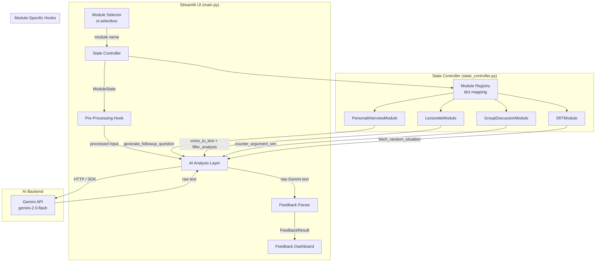
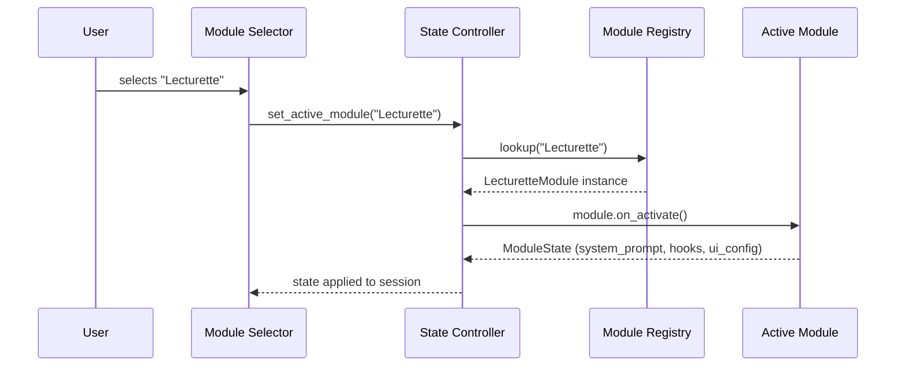
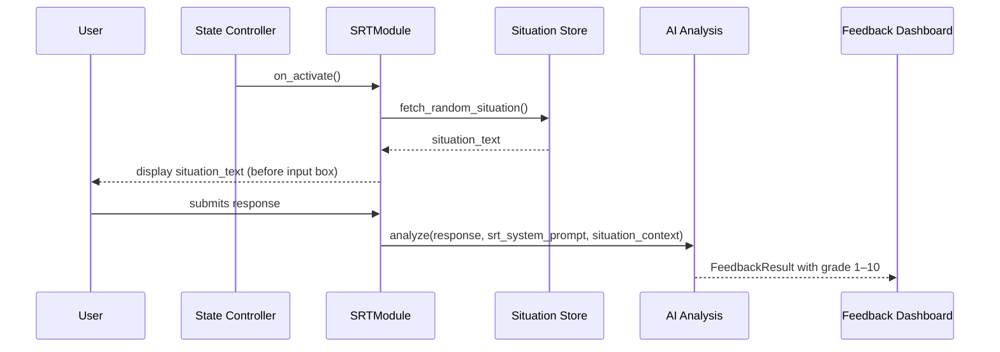
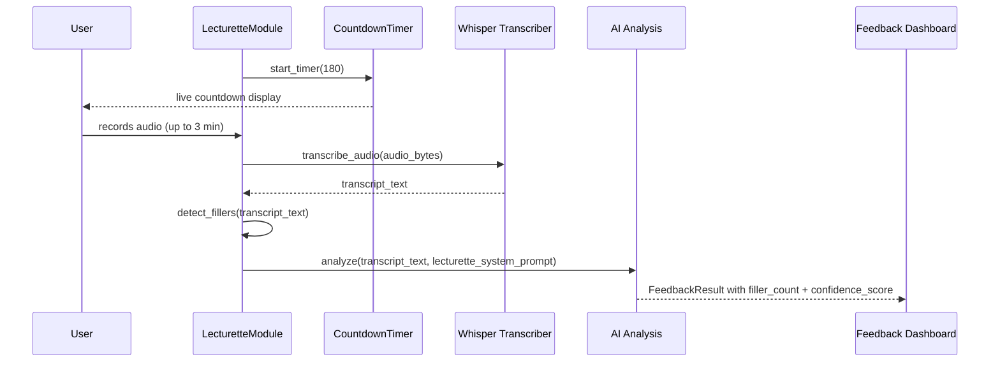
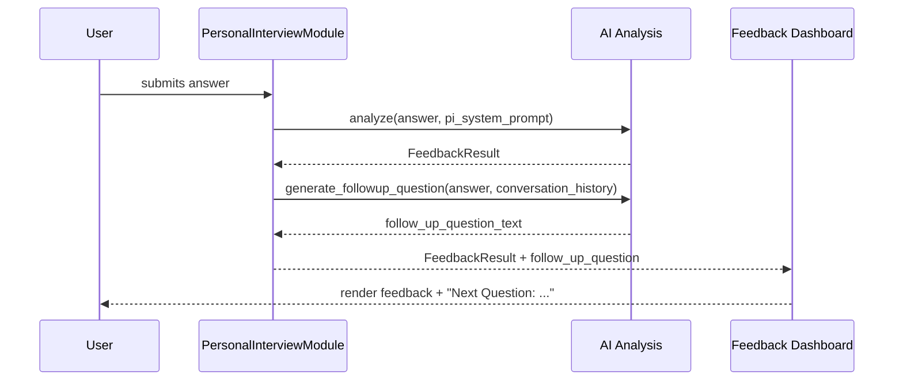

# Design Document: SSB State Controller

## Overview

The SSB State Controller replaces the current single static `SYSTEM_PROMPT` and bare `st.selectbox` with a module-aware dispatch layer that dynamically selects the correct AI system instruction, activates module-specific pre-processing hooks (voice transcription for Lecturette, situation randomisation for SRT), and routes the result through a unified feedback pipeline.

The four supported modules — **Personal Interview**, **Lecturette**, **Group Discussion**, and **SRT** — each carry their own system prompt, dynamic function, and AI integration logic. The controller acts as the single source of truth for which module is active and what behaviour that implies, keeping `main.py` free of scattered `if mode == ...` branches.

This design builds directly on top of the existing `get_feedback()` / `transcribe_audio()` helpers and the `FeedbackResult` pipeline introduced in the SSB Feedback Integration spec, extending rather than replacing them.

---

## Architecture



---

## Sequence Diagrams

### Module Activation Flow



### SRT Module — Situation Fetch & Evaluate Flow



### Lecturette Module — Voice + Filler Analysis Flow



### Personal Interview — Follow-Up Question Flow



---

## Components and Interfaces

### Component 1: State Controller

**Purpose**: Central dispatcher that owns the active module reference and exposes a uniform interface to the UI layer.

**Interface**:
```python
class StateController:
    def set_active_module(self, module_name: str) -> ModuleState: ...
    def get_active_module(self) -> BaseModule: ...
    def get_system_prompt(self) -> str: ...
    def run_pre_hook(self, input_data: InputData) -> ProcessedInput: ...
    def run_post_hook(self, result: FeedbackResult) -> FeedbackResult: ...
```

**Responsibilities**:
- Maintain a single `_active_module` reference in `st.session_state`
- Delegate all module-specific behaviour to the active module instance
- Raise `ValueError` for unknown module names

---

### Component 2: Module Registry

**Purpose**: Dictionary mapping module name strings to module class instances; the single place to register new modules.

**Interface**:
```python
MODULE_REGISTRY: dict[str, BaseModule] = {
    "Personal Interview":    PersonalInterviewModule(),
    "Lecturette":            LecturetteModule(),
    "Group Discussion":      GroupDiscussionModule(),
    "SRT":                   SRTModule(),
}

def get_module(name: str) -> BaseModule: ...
```

**Responsibilities**:
- Provide O(1) lookup by module name
- Serve as the authoritative list of supported modules (`MODULES` constant)

---

### Component 3: BaseModule (Abstract)

**Purpose**: Contract that every module must satisfy; enforces a uniform interface across all four modules.

**Interface**:
```python
from abc import ABC, abstractmethod

class BaseModule(ABC):
    name: str
    system_prompt: str

    @abstractmethod
    def on_activate(self) -> None: ...

    @abstractmethod
    def pre_process(self, input_data: InputData) -> ProcessedInput: ...

    @abstractmethod
    def post_process(self, result: FeedbackResult) -> FeedbackResult: ...

    def render_ui_extras(self) -> None:
        """Optional: render module-specific UI widgets before the input box."""
        pass
```

---

### Component 4: PersonalInterviewModule

**Purpose**: Simulates a real SSB interview by generating a contextual follow-up question after each answer.

**Interface**:
```python
class PersonalInterviewModule(BaseModule):
    name = "Personal Interview"

    def pre_process(self, input_data: InputData) -> ProcessedInput: ...
    def post_process(self, result: FeedbackResult) -> FeedbackResult: ...
    def generate_followup_question(
        self,
        answer: str,
        history: list[dict],
        client: genai.Client
    ) -> str: ...
```

---

### Component 5: LecturetteModule

**Purpose**: Adds a 3-minute countdown timer and filler-word analysis on top of the standard voice transcription.

**Interface**:
```python
class LecturetteModule(BaseModule):
    name = "Lecturette"
    DURATION_SECONDS: int = 180

    def pre_process(self, input_data: InputData) -> ProcessedInput: ...
    def post_process(self, result: FeedbackResult) -> FeedbackResult: ...
    def render_ui_extras(self) -> None: ...          # renders countdown timer
    def detect_fillers(self, transcript: str) -> FillerReport: ...
    def transcribe_hook(self, audio_bytes) -> str: ...
```

---

### Component 6: GroupDiscussionModule

**Purpose**: Generates three opposing viewpoints to the user's entry to simulate a group discussion environment.

**Interface**:
```python
class GroupDiscussionModule(BaseModule):
    name = "Group Discussion"

    def pre_process(self, input_data: InputData) -> ProcessedInput: ...
    def post_process(self, result: FeedbackResult) -> FeedbackResult: ...
    def generate_counter_arguments(
        self,
        user_entry: str,
        client: genai.Client
    ) -> list[str]: ...   # always returns exactly 3 strings
```

---

### Component 7: SRTModule

**Purpose**: Fetches a random situation before the input box appears and grades the user's response on a 1–10 scale.

**Interface**:
```python
class SRTModule(BaseModule):
    name = "SRT"

    def pre_process(self, input_data: InputData) -> ProcessedInput: ...
    def post_process(self, result: FeedbackResult) -> FeedbackResult: ...
    def render_ui_extras(self) -> None: ...          # displays situation card
    def fetch_random_situation(self) -> str: ...
```

---

## Data Models

### ModuleState

```python
from dataclasses import dataclass, field

@dataclass
class ModuleState:
    module_name: str
    system_prompt: str
    active_hooks: list[str] = field(default_factory=list)
    ui_extras_enabled: bool = False
    metadata: dict = field(default_factory=dict)
```

**Validation Rules**:
- `module_name` must be one of the four registered module names
- `system_prompt` must be non-empty
- `active_hooks` contains only known hook identifiers

---

### InputData

```python
@dataclass
class InputData:
    raw_text: str
    audio_bytes: bytes | None = None
    module_name: str = ""
    context: dict = field(default_factory=dict)   # e.g., {"situation": "..."}
```

---

### ProcessedInput

```python
@dataclass
class ProcessedInput:
    text: str                    # final text sent to AI
    module_name: str
    context: dict = field(default_factory=dict)
    filler_report: "FillerReport | None" = None
    situation: str | None = None
```

---

### FillerReport

```python
@dataclass
class FillerReport:
    filler_count: int
    fillers_found: list[str]     # e.g., ["um", "ah", "uh"]
    confidence_score: float      # 0.0 – 1.0, derived from filler density
```

**Validation Rules**:
- `filler_count >= 0`
- `confidence_score` in `[0.0, 1.0]`
- `fillers_found` length equals `filler_count`

---

### SituationStore (in-memory default)

```python
SITUATIONS: list[str] = [
    "You are leading a patrol and your radio fails mid-mission. Two team members are injured.",
    "A junior colleague is found leaking confidential information. He is also your close friend.",
    "Your unit is stranded due to a flash flood. Supplies last 48 hours. Rescue ETA is 72 hours.",
    # ... more situations
]
```

---

## Algorithmic Pseudocode

### State Controller Dispatch Algorithm

```pascal
PROCEDURE set_active_module(module_name)
  INPUT:  module_name: String
  OUTPUT: ModuleState

  PRECONDITIONS:
    - module_name IS NOT empty
    - module_name IN MODULE_REGISTRY

  POSTCONDITIONS:
    - st.session_state["active_module"] = MODULE_REGISTRY[module_name]
    - RETURN ModuleState with correct system_prompt and hooks

  BEGIN
    IF module_name NOT IN MODULE_REGISTRY THEN
      RAISE ValueError("Unknown module: " + module_name)
    END IF

    module ← MODULE_REGISTRY[module_name]
    module.on_activate()

    state ← ModuleState(
      module_name      = module_name,
      system_prompt    = module.system_prompt,
      active_hooks     = module.active_hooks,
      ui_extras_enabled = module.has_ui_extras
    )

    st.session_state["active_module"] ← module
    st.session_state["module_state"]  ← state

    RETURN state
  END
END PROCEDURE
```

---

### SRT Situation Fetch Algorithm

```pascal
PROCEDURE fetch_random_situation()
  INPUT:  (none — reads from SITUATIONS store)
  OUTPUT: situation_text: String

  PRECONDITIONS:
    - SITUATIONS list IS NOT empty

  POSTCONDITIONS:
    - RETURN a String from SITUATIONS
    - Each call has equal probability of returning any situation
    - st.session_state["current_situation"] IS set to returned value

  BEGIN
    idx ← random.randint(0, LENGTH(SITUATIONS) - 1)
    situation_text ← SITUATIONS[idx]
    st.session_state["current_situation"] ← situation_text
    RETURN situation_text
  END
END PROCEDURE
```

---

### Lecturette Filler Detection Algorithm

```pascal
PROCEDURE detect_fillers(transcript)
  INPUT:  transcript: String
  OUTPUT: FillerReport

  PRECONDITIONS:
    - transcript IS NOT empty

  POSTCONDITIONS:
    - result.filler_count >= 0
    - result.confidence_score IN [0.0, 1.0]
    - result.fillers_found contains only tokens from FILLER_WORDS

  LOOP INVARIANT:
    - All tokens processed so far have been checked against FILLER_WORDS
    - filler_count equals the number of matching tokens seen so far

  BEGIN
    FILLER_WORDS ← {"um", "uh", "ah", "like", "you know", "basically", "literally"}
    tokens       ← TOKENIZE(LOWERCASE(transcript))
    fillers_found ← []
    filler_count  ← 0

    FOR each token IN tokens DO
      ASSERT filler_count = LENGTH(fillers_found)   // loop invariant
      IF token IN FILLER_WORDS THEN
        fillers_found.APPEND(token)
        filler_count ← filler_count + 1
      END IF
    END FOR

    total_words      ← LENGTH(tokens)
    filler_density   ← filler_count / MAX(total_words, 1)
    confidence_score ← MAX(0.0, 1.0 - (filler_density * 5.0))
    confidence_score ← MIN(confidence_score, 1.0)

    RETURN FillerReport(
      filler_count     = filler_count,
      fillers_found    = fillers_found,
      confidence_score = confidence_score
    )
  END
END PROCEDURE
```

---

### Personal Interview Follow-Up Question Algorithm

```pascal
PROCEDURE generate_followup_question(answer, history, client)
  INPUT:  answer:  String (candidate's latest answer)
          history: List[Dict] (prior Q&A pairs)
          client:  genai.Client
  OUTPUT: follow_up: String

  PRECONDITIONS:
    - answer IS NOT empty
    - client IS authenticated

  POSTCONDITIONS:
    - follow_up IS a non-empty question string
    - follow_up is contextually related to answer

  BEGIN
    context_prompt ← BUILD_FOLLOWUP_PROMPT(answer, history)

    TRY
      result ← client.models.generate_content(
                  model    = GEMINI_MODEL,
                  contents = context_prompt
               )
      ASSERT result.text IS NOT NULL AND result.text IS NOT empty
      RETURN STRIP(result.text)
    CATCH ApiException AS e
      RAISE RuntimeError("Follow-up generation failed: " + e.message)
    END TRY
  END
END PROCEDURE
```

---

### Group Discussion Counter-Argument Algorithm

```pascal
PROCEDURE generate_counter_arguments(user_entry, client)
  INPUT:  user_entry: String
          client:     genai.Client
  OUTPUT: arguments: List[String]  // exactly 3 items

  PRECONDITIONS:
    - user_entry IS NOT empty
    - client IS authenticated

  POSTCONDITIONS:
    - LENGTH(arguments) = 3
    - Each argument is a non-empty string
    - Each argument presents a viewpoint opposing user_entry

  BEGIN
    prompt ← BUILD_COUNTER_ARG_PROMPT(user_entry)

    TRY
      result ← client.models.generate_content(
                  model    = GEMINI_MODEL,
                  contents = prompt
               )
      raw_text   ← result.text
      arguments  ← PARSE_NUMBERED_LIST(raw_text, expected_count=3)

      IF LENGTH(arguments) ≠ 3 THEN
        // Fallback: split by newline and take first 3 non-empty lines
        arguments ← [line FOR line IN SPLIT(raw_text, "\n") IF STRIP(line) ≠ ""][:3]
      END IF

      ASSERT LENGTH(arguments) = 3
      RETURN arguments
    CATCH ApiException AS e
      RAISE RuntimeError("Counter-argument generation failed: " + e.message)
    END TRY
  END
END PROCEDURE
```

---

## Key Functions with Formal Specifications

### `set_active_module(module_name: str) -> ModuleState`

**Preconditions**:
- `module_name` is a non-empty string
- `module_name in MODULE_REGISTRY`

**Postconditions**:
- `st.session_state["active_module"]` is the module instance for `module_name`
- Returned `ModuleState.system_prompt` is non-empty
- No other module's state is mutated

**Loop Invariants**: N/A

---

### `fetch_random_situation() -> str`

**Preconditions**:
- `SITUATIONS` list is non-empty

**Postconditions**:
- Returns a string that is an element of `SITUATIONS`
- `st.session_state["current_situation"]` equals the returned string
- Distribution is uniform over `SITUATIONS`

---

### `detect_fillers(transcript: str) -> FillerReport`

**Preconditions**:
- `transcript` is a non-empty string

**Postconditions**:
- `result.filler_count == len(result.fillers_found)`
- `0.0 <= result.confidence_score <= 1.0`
- No exception raised for any non-empty string input

**Loop Invariants**:
- After processing `k` tokens: `filler_count == len([t for t in tokens[:k] if t in FILLER_WORDS])`

---

### `generate_counter_arguments(user_entry: str, client: genai.Client) -> list[str]`

**Preconditions**:
- `user_entry` is non-empty
- `client` is an authenticated `genai.Client`

**Postconditions**:
- Returns a list of exactly 3 non-empty strings
- Each string presents a viewpoint opposing `user_entry`
- Raises `RuntimeError` on API failure (never returns partial list)

---

### `generate_followup_question(answer: str, history: list[dict], client: genai.Client) -> str`

**Preconditions**:
- `answer` is non-empty
- `client` is authenticated

**Postconditions**:
- Returns a non-empty question string
- Question is contextually derived from `answer` and `history`
- `history` is not mutated

---

## Example Usage

```python
# ── Module activation on sidebar change ──────────────────────────────────────
controller = StateController()

with st.sidebar:
    selected = st.selectbox("Practice Module", list(MODULE_REGISTRY.keys()))
    if selected != st.session_state.get("module_name"):
        state = controller.set_active_module(selected)
        st.session_state["module_name"] = selected

# ── Render module-specific UI extras (e.g., SRT situation card, timer) ────────
active_module = controller.get_active_module()
active_module.render_ui_extras()

# ── Text input tab ────────────────────────────────────────────────────────────
user_text = st.text_area("Your response:", height=220)

if st.button("Evaluate"):
    input_data = InputData(raw_text=user_text, module_name=selected)
    processed  = active_module.pre_process(input_data)

    raw_feedback = get_feedback(processed.text, controller.get_system_prompt())
    result       = parse_feedback(raw_feedback)
    result       = active_module.post_process(result)

    render_feedback_dashboard(result)

# ── SRT: situation is shown before input box via render_ui_extras() ───────────
# SRTModule.render_ui_extras() calls fetch_random_situation() on first render
# and stores it in st.session_state["current_situation"]

# ── Lecturette: voice tab with timer ─────────────────────────────────────────
# LecturetteModule.render_ui_extras() renders a st.empty() countdown
# LecturetteModule.transcribe_hook() wraps the existing transcribe_audio()
# and appends filler analysis to the FeedbackResult metadata
```

---

## Correctness Properties

1. **Module Completeness**: For all `m` in `MODULE_REGISTRY`, `set_active_module(m)` returns a `ModuleState` with a non-empty `system_prompt` distinct from every other module's prompt.

2. **Dispatch Exclusivity**: At any point in time, exactly one module is active in `st.session_state`; switching modules atomically replaces the previous state.

3. **SRT Situation Coverage**: For all `n` calls to `fetch_random_situation()`, the returned situation is always an element of `SITUATIONS`; no call returns an empty string.

4. **Filler Score Bounds**: For all non-empty transcripts `t`, `detect_fillers(t).confidence_score` is in `[0.0, 1.0]`.

5. **Counter-Argument Count**: For all non-empty `user_entry` strings and valid `client` instances, `generate_counter_arguments(user_entry, client)` returns a list of exactly 3 non-empty strings or raises `RuntimeError`.

6. **System Prompt Isolation**: The system prompt used for module `m` is never used when module `m'` (where `m' != m`) is active; cross-contamination between module prompts is a correctness violation.

7. **Hook Idempotency**: Calling `on_activate()` on an already-active module produces the same `ModuleState` as the first activation (no cumulative side effects).

---

## Error Handling

### Error Scenario 1: Unknown Module Name

**Condition**: `set_active_module()` called with a name not in `MODULE_REGISTRY`
**Response**: Raises `ValueError("Unknown module: <name>")`
**Recovery**: Caught in the sidebar handler; `st.error()` displayed; previous module remains active

### Error Scenario 2: Empty Situation Store

**Condition**: `SITUATIONS` list is empty when `fetch_random_situation()` is called
**Response**: Raises `RuntimeError("Situation store is empty")`
**Recovery**: `SRTModule.render_ui_extras()` catches this and displays `st.warning("No situations available. Please add situations to the store.")`

### Error Scenario 3: Filler Detection on Empty Transcript

**Condition**: `detect_fillers("")` called (e.g., Whisper returns empty string)
**Response**: Returns `FillerReport(filler_count=0, fillers_found=[], confidence_score=1.0)`
**Recovery**: No exception; upstream `validate_input()` should have caught the empty transcript first

### Error Scenario 4: Counter-Argument Parse Failure

**Condition**: Gemini returns a response that cannot be parsed into 3 distinct arguments
**Response**: Fallback splits by newline and takes first 3 non-empty lines; if still fewer than 3, pads with `"[No counter-argument generated]"`
**Recovery**: UI always receives exactly 3 strings; degraded quality is logged but not surfaced as an error

### Error Scenario 5: Follow-Up Question API Failure

**Condition**: Gemini API fails during `generate_followup_question()`
**Response**: Raises `RuntimeError("Follow-up generation failed: <detail>")`
**Recovery**: Caught in the PI tab handler; feedback is still displayed without a follow-up question; `st.warning("Could not generate follow-up question.")` shown

---

## Testing Strategy

### Unit Testing Approach

Test each module and the controller in isolation using `pytest`:

- `test_set_active_module_valid`: all four module names → correct `ModuleState` returned
- `test_set_active_module_invalid`: unknown name → `ValueError` raised
- `test_fetch_random_situation`: returns element of `SITUATIONS`; `session_state` updated
- `test_fetch_random_situation_empty_store`: empty list → `RuntimeError`
- `test_detect_fillers_no_fillers`: clean transcript → `filler_count=0`, `confidence_score=1.0`
- `test_detect_fillers_with_fillers`: "um ah basically" → `filler_count=3`
- `test_detect_fillers_confidence_bounds`: any transcript → score in `[0.0, 1.0]`
- `test_counter_args_parse_fallback`: malformed Gemini response → still 3 items returned
- `test_module_prompts_distinct`: all four `system_prompt` values are unique strings

### Property-Based Testing Approach

**Property Test Library**: `hypothesis`

Key properties:

- **Filler Score Bounds**: For any non-empty string `t`, `detect_fillers(t).confidence_score` is always in `[0.0, 1.0]`
- **Filler Count Consistency**: For any string `t`, `detect_fillers(t).filler_count == len(detect_fillers(t).fillers_found)`
- **Situation Always Valid**: For any non-empty `SITUATIONS` list, `fetch_random_situation()` always returns an element of that list
- **Module Isolation**: For any two distinct module names `m1`, `m2`, their `system_prompt` values are never equal

### Integration Testing Approach

- Mock `genai.Client` to return fixture responses; verify the full pipeline: `set_active_module` → `render_ui_extras` → `pre_process` → `get_feedback` → `post_process` → `render_feedback_dashboard`
- Test module switching: activate PI, then switch to SRT; verify `session_state` is cleanly replaced
- Test SRT end-to-end: situation displayed → user responds → grade appears in feedback

---

## Performance Considerations

- The `MODULE_REGISTRY` dict is built once at import time; `set_active_module` is O(1).
- `detect_fillers` is O(n) in transcript length — negligible for 3-minute speech (~450 words).
- `fetch_random_situation` is O(1) with `random.randint`.
- The Lecturette countdown timer uses `st.empty()` with `time.sleep(1)` in a loop; this blocks the Streamlit thread. Consider running it in a background thread or using `st.session_state` + `st.rerun()` for a non-blocking implementation.
- All Gemini API calls (follow-up questions, counter-arguments) are additional round-trips beyond the main feedback call. Wrap each in `st.spinner` to maintain perceived responsiveness.

---

## Security Considerations

- Module system prompts are defined in code, not user-supplied; no prompt injection surface from the registry itself.
- The `context` dict in `InputData` / `ProcessedInput` must not be populated from raw user input without sanitisation, as it is interpolated into prompts.
- `SITUATIONS` is a static in-memory list by default. If migrated to a database, parameterise queries to prevent SQL injection.
- The Gemini API key remains in `.streamlit/secrets.toml`; no new secrets are introduced by this feature.

---

## Dependencies

| Package | Version | Purpose |
|---|---|---|
| `streamlit` | ≥1.35 | UI framework |
| `google-genai` | ≥1.0 | Gemini API SDK |
| `openai-whisper` | latest | Audio transcription (Lecturette hook) |
| `random` | stdlib | Situation randomisation (SRT) |
| `re` | stdlib | Filler detection tokenisation |
| `abc` | stdlib | `BaseModule` abstract class |
| `dataclasses` | stdlib | `ModuleState`, `InputData`, `ProcessedInput`, `FillerReport` |
| `pytest` | ≥8.0 | Unit testing |
| `hypothesis` | ≥6.0 | Property-based testing |
